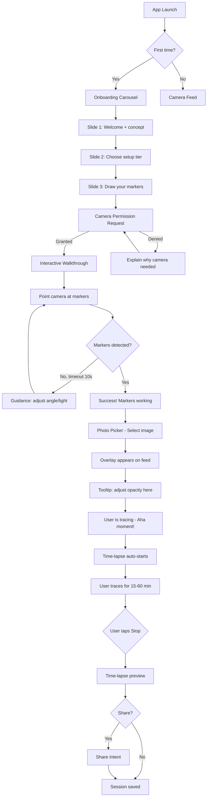
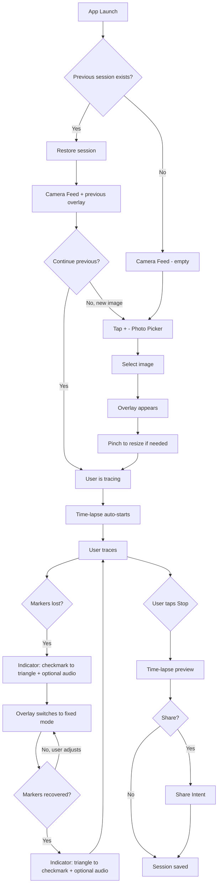
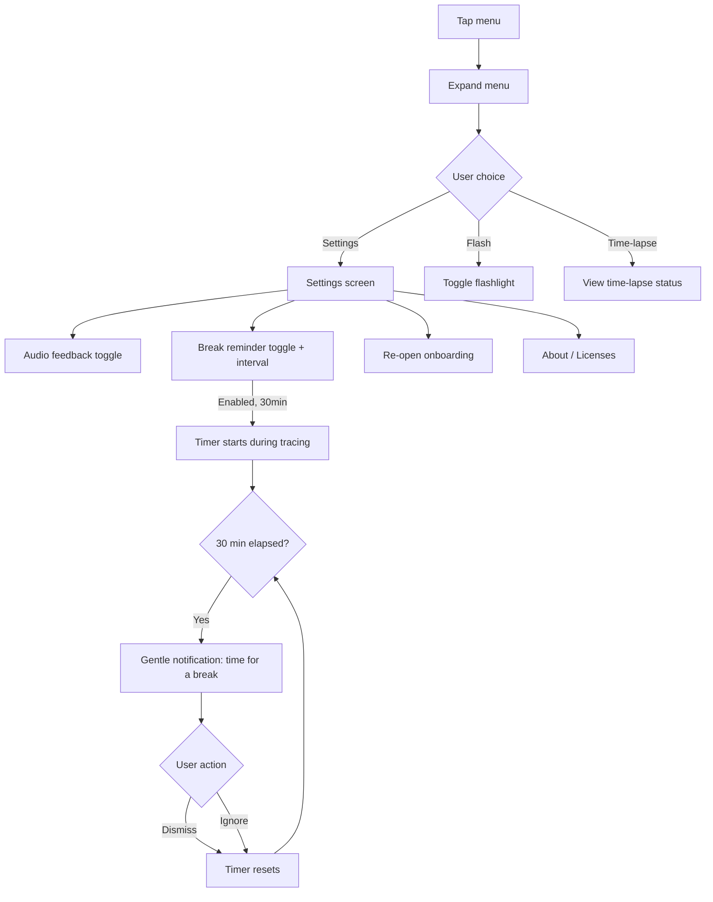

# UX Design Specification TraceGlass

**Author:** JN0V
**Date:** 2026-02-08

---

<!-- UX design content will be appended sequentially through collaborative workflow steps -->

## Executive Summary

### Project Vision

TraceGlass is an AR tracing app that makes itself invisible. The overlay guides the user's hand while they focus on drawing, not on technology. The app is a silent assistant — it holds the image steady, tracks the paper, and gets out of the way.

The UI is camera-first: 95% of the screen is the live camera feed with the overlay. Controls exist at the periphery, revealed only when needed.

### Target Users

**Primary — Léa (13 years old):**
- Draws for fun, wants to reproduce images she likes
- Zero patience for technical setup — must "just work" after initial onboarding
- Uses the app at home, in her room, often in the evening
- Sessions: 15-60 minutes
- Minimum bar: if Léa can use it without help, anyone can

**Secondary — Amateur artists & hobbyists:**
- Want to trace patterns, references, or templates onto paper
- Range from teens to adults, low to medium tech proficiency
- May use improvised setups (books as stands, tape for markers)

### Key Design Challenges

1. **Camera-first UI** — Controls must not obstruct the drawing view. The screen IS the drawing surface. Every pixel of overlay matters.
2. **Physical-digital bridge** — Onboarding must guide a PHYSICAL setup (draw markers, position phone, place glass) before the app can work. This is unique — most apps only onboard digital actions.
3. **Gesture conflicts** — The screen displays the active drawing area. Accidental touches must not move the overlay. Gestures must be intentional and spatially separated from the drawing zone.
4. **Tracking feedback** — The user must know if markers are detected or lost, without intrusive visual noise. Audio cues (optional, off by default) provide non-visual feedback when user's focus is on paper.

### Design Opportunities

1. **Instant "Aha moment"** — First overlay on paper through the camera = magic. Onboarding must reach this moment in < 10 minutes.
2. **Decorative markers as fun** — Hearts, stars, circles — the child WANTS to draw them. A technical constraint becomes a creative element.
3. **Time-lapse as reward** — The shareable video motivates completing the drawing. Recording is automatic, sharing is 1 tap.
4. **Progressive disclosure** — Controls hidden by default, revealed on demand. Clean screen = the drawing is the star, not the app.
5. **Audio feedback for tracking** — Optional subtle cues (off by default) alert the user when tracking is lost/recovered without requiring them to look away from their paper. Useful for focused drawing sessions.

## Core User Experience

### Defining Experience

The core action is **tracing**: pencil on paper, following an overlay line. Everything in the app serves this single gesture. If the overlay is stable and the controls invisible, the experience succeeds.

The phone is physically stationary — balanced on a stand, box, or improvised support. The user interacts with the screen sporadically (to pick an image, adjust opacity), then focuses on paper for long stretches. The app must respect this rhythm: brief digital interaction → sustained physical drawing → brief digital interaction.

### Platform Strategy

- **Android native only** — touch-based, portrait and landscape support (landscape likely for table drawing)
- **100% offline** — zero network latency, zero loading states
- **Device capabilities used:** Camera (AR overlay), flashlight (low-light assist), audio output (optional tracking cues, break reminders)
- **Explicitly NOT used:** Haptic/vibration — the phone is balanced on a support. ANY vibration risks moving the device and ruining the overlay alignment. Haptic feedback is forbidden.
- **Physical constraint:** The phone is stationary. Touch interactions are infrequent and deliberate, not continuous.

### Effortless Interactions

| Interaction | Must be... | How |
|------------|-----------|-----|
| Marker tracking | Automatic, silent | Detection starts when markers are visible. No user action. |
| Overlay scaling | Automatic | Computed from marker spacing. No manual resize. |
| Fallback without markers | Transparent | Overlay switches to fixed mode without dramatic error messages. |
| Session save | Automatic | Background → save. Foreground → restore. Zero intervention. |
| Time-lapse capture | Automatic | Periodic snapshots in background. User doesn't think about it while drawing. |

### Critical Success Moments

1. **"Aha" — First overlay:** User sees the image superimposed on their paper through the camera. This is the moment that sells the app. Onboarding must reach it in < 10 minutes.
2. **First successful stroke:** The pencil follows the overlay line and the result is accurate. Confidence builds.
3. **Resume after pause:** User returns, app restores everything exactly. "It's like I never left."
4. **Time-lapse share:** Drawing complete, user watches the video and wants to show it. 1 tap → share intent.

### Experience Principles

1. **The app is transparent** — The user sees their paper and the guide image, not an interface. Every UI element that isn't the drawing must justify its presence.
2. **Physical first** — The real experience is pencil + paper. The app is a tool, not the destination. UX must respect that the user watches their paper, not the screen.
3. **Zero punishment** — Markers lost → silent fallback. Battery dead → session saved. App closed → resume possible. The user never loses their work.
4. **Progressive disclosure** — First launch: the minimum. Regular use: power features reveal themselves naturally (shortcuts, settings, audio feedback, break reminders).
5. **Accessible by default** — If a 13-year-old doesn't understand in 30 seconds, it's too complex.
6. **No vibration, ever** — The device is physically balanced. Stability is sacred. All feedback is visual or audio, never haptic.
7. **Care for the artist** — Optional break reminders (off by default, configurable interval) encourage healthy drawing habits: rest eyes, stretch wrists.

## Desired Emotional Response

### Primary Emotional Goals

**"I can draw this."** — The app transforms "I can't draw" into "look what I made." Pride in the result is the central emotion. The app doesn't draw FOR the user — it gives them the confidence to trace.

### Emotional Journey Mapping

| Moment | Target Emotion | Emotion to Avoid |
|--------|---------------|-----------------|
| Discovery / first launch | Curiosity, excitement | Technical intimidation |
| Onboarding (physical setup) | Guided confidence: "this is easy" | Frustration: "too complicated" |
| First overlay visible | Wonder: "this is magic!" | Disappointment: "it doesn't work" |
| Tracing in progress | Flow, zen concentration | Stress (unstable overlay, intrusive UI) |
| Markers lost | Calm: "no big deal, it'll come back" | Panic: "I lost everything" |
| Drawing complete | Pride: "I made this" | Indifference |
| Time-lapse viewed | Satisfaction + urge to share | — |
| Return after pause | Relief: "everything is here" | Frustration: "have to redo everything" |

### Micro-Emotions

- **Confidence > Confusion** — Every screen has ONE clear purpose. No ambiguous multi-choice.
- **Accomplishment > Frustration** — Markerless fallback prevents disruption. The user always continues.
- **Calm > Anxiety** — Tracing mode is a zen zone. No notifications, no counters, no pressure.
- **Autonomy > Dependence** — The user learns quickly and no longer needs onboarding.

### Design Implications

| Emotion | UX Decision |
|---------|------------|
| Wonder (first overlay) | Onboarding optimized to reach this moment fast. No long tutorials BEFORE the magic. |
| Flow (tracing) | Minimal UI during tracing. Hidden controls. Screen = drawing only. |
| Calm (tracking loss) | Smooth transition to fixed mode. No red alerts. Discreet icon + optional audio. |
| Pride (result) | Time-lapse highlights the PROCESS, not just the result. The user sees their effort. |
| Relief (resume) | Instant restoration: overlay + image + exact position. Zero action required. |
| Safety (breaks) | Optional reminders that are caring, never guilt-inducing. Gentle tone, not warnings. |

### Emotional Design Principles

1. **Pride is the product** — The app doesn't sell technology, it sells "look what I drew." All design must amplify this feeling.
2. **Calm is non-negotiable** — Tracing mode is a zen space. No unsolicited interruptions. The only feedback is what the user has enabled.
3. **Failure is graceful** — No aggressive error states. No red messages. No "Something went wrong." Problems resolve silently or with gentle guidance.
4. **User's time is sacred** — Every tap, every screen, every second of onboarding must prove its value. If it can be removed without loss, remove it.

## UX Pattern Analysis & Inspiration

### Inspiring Products Analysis

**1. Procreate (iPad)** — The zen creative experience
- UI disappears during drawing — fullscreen canvas by default
- Controls at screen edges, accessible without leaving the work zone
- Undo via double-tap, not a button to hunt for
- **Takeaway:** Screen = canvas. Controls are peripheral and contextual.

**2. Native Camera App (Android/iOS)** — Camera-first paradigm
- Screen IS the viewfinder. Controls in bottom bar + discreet icons at top
- Mode switching via horizontal swipe, not menu navigation
- Advanced settings hidden behind a ">" or swipe up
- **Takeaway:** Visual hierarchy. Camera feed dominates, controls are lightweight overlay.

**3. IKEA Place (AR)** — AR accessible to the general public
- First launch: scan the floor, object appears → "Aha moment" in < 30s
- No technical AR tutorial. Just "point your camera at the floor"
- Subtle tracking feedback (floor grid when detected)
- **Takeaway:** Onboarding through action, not explanation. "Point your camera" > "Here's how ArUco detection works."

**4. Forest (Focus app)** — The caring timer
- Focus timer with gentle reminders
- Visual reward (growing tree) — no punishment
- **Takeaway:** Break reminders should be caring, not guilt-inducing. Reward > punishment.

### Transferable UX Patterns

**Navigation:**
- Camera-first fullscreen layout (native camera app) — feed occupies 100% of screen
- Bottom bar for primary controls (camera app) — adapted for tracing controls (opacity, image picker, flashlight, time-lapse)
- Swipe/tap to reveal controls (Procreate) — progressive disclosure without navigation

**Interaction:**
- Onboarding through action (IKEA Place) — guide toward the "Aha moment," don't explain the technology
- Subtle tracking feedback (IKEA Place) — discreet indicator, not error states
- Contextual controls (Procreate) — show only what's relevant to current state

**Emotional:**
- Gentle reminders (Forest) — simplified to timer + soft notification, no gamification
- Zen workspace (Procreate) — tracing mode = distraction-free zone

### Anti-Patterns to Avoid

| Anti-Pattern | Why It's Bad for Us | Seen In |
|-------------|-------------------|---------|
| 5+ screen tutorial before action | Kills excitement. User wants to draw, not read. | Many AR apps |
| Blocking error modal | Breaks zen flow. "Markers not found" in red = anxiety. | Amateur CV apps |
| Too many visible buttons | Cluttered screen. The drawing is no longer the star. | Overloaded camera apps |
| Settings buried in sub-menus | User never finds the option they need. | Classic Android settings |
| Forced account creation | Not relevant here (offline), but the principle: zero friction before value. | Nearly all apps |

### Design Inspiration Strategy

**Adopt:**
- Camera-first layout (native camera) — feed occupies 100% of screen
- Progressive disclosure (Procreate) — controls hidden, revealed on tap/swipe
- Onboarding through action (IKEA Place) — guide toward "Aha moment," don't explain tech
- Subtle tracking feedback (IKEA Place) — discreet indicator, not error states

**Adapt:**
- Bottom bar (camera app) → adapted for tracing controls (opacity, image picker, flashlight, time-lapse)
- Break reminders (Forest) → simplified: just a timer + gentle notification, no gamification

**Avoid:**
- Any long text tutorial before action
- Any blocking modal for tracking errors
- Any visual overload of the main screen

## Design System Foundation

### Design System Choice

**Material 3 (Material You)** — Native Jetpack Compose integration.

### Rationale for Selection

- **Native Compose** — Zero additional dependency. M3 components are built into Jetpack Compose.
- **Accessibility built-in** — Contrast, touch targets, screen reader support — handled by default.
- **Dynamic Color** — On Android 12+, theme adapts to user's wallpaper. The app visually "belongs" to the user's phone.
- **KISS** — No custom design system to maintain. Use M3 defaults, customize the strict minimum.
- **Solo dev with AI** — Well-documented system that AI agents know thoroughly. Less custom = fewer bugs.

### Implementation Approach

The app is 95% camera feed. M3 only applies to:

1. **Onboarding** — Pages with text, illustrations, buttons (standard M3). This is where the most UI work lives: overlay illustrations, step-by-step arrows, setup guidance with annotated diagrams.
2. **Overlay controls** — Bottom sheet or floating controls on camera feed (M3 Surface + custom layout)
3. **Settings** — Classic list of switches and sliders (standard M3)
4. **Tracking status** — Small overlay indicator (custom, but M3 colors)

### Customization Strategy

**Design tokens to define (finalized in Visual Foundation step):**

| Token | Direction | Usage |
|-------|----------|-------|
| Primary | TBD (blue/teal glass theme?) | Primary buttons, accents |
| Surface | Transparent or semi-transparent | Overlay controls on camera feed |
| Error | Soft (amber/orange, NOT red) | Tracking lost — calm, not alarm |
| On Surface | White with shadow/outline | Text/icons readable on camera feed |

**Key customization:** All overlay UI elements must be readable on any camera background (light paper, dark table, mixed). This requires either semi-transparent backgrounds or text/icon outlines — standard M3 elevation won't work on camera feed.

## Defining Core Experience

### Defining Experience

> **"Point your camera at your paper, pick an image, trace."**

That's what the user tells a friend. Not "it's an AR app with fiducial marker detection." The experience boils down to 3 gestures: point, pick, trace.

### User Mental Model

**How the user sees the problem today:**
- "I want to reproduce this drawing but I can't freehand it"
- Current solutions: tracing paper (works but size-limited), projector (expensive, bulky), lightbox (not adapted to all surfaces)
- TraceGlass = "a digital tracing paper in my phone"

**What the user expects to see:**
- The image appears on the paper through the screen → tracing paper metaphor
- The image stays fixed even if the phone shifts slightly → the "magic"
- The image is visible enough to guide but transparent enough to see their stroke

**Predictable confusion points:**
- "Why do I need to draw markers?" → Onboarding must explain with a clear, quick "because"
- "The image is moving!" → Visual tracking status indicator + guidance to reposition
- "It's too bright/too dark" → Opacity slider accessible immediately, not in a menu

### Success Criteria

| Criterion | Measure |
|-----------|---------|
| Overlay is stable | Image doesn't "jump" during tracing (< 2px visible jitter) |
| Setup is fast | From launch to "I'm tracing" in < 10 min (first time), < 2 min (return) |
| Controls are invisible | User traces for 5+ minutes without touching the screen |
| Resume is transparent | After close, user finds everything back in < 3 seconds |
| User feels proud | They want to show both the result AND the time-lapse |

### Novel UX Patterns

| Aspect | Type | Detail |
|--------|------|--------|
| Camera feed fullscreen | Established | Identical to any camera app |
| Overlay on camera | Established | Like AR filters (Snapchat, Instagram) |
| Tracking via hand-drawn markers | Novel | User draws their own markers — no printed QR code. Requires education. |
| Auto-scaling by marker spacing | Novel | Zoom happens "by itself" — no manual pinch-to-zoom. May surprise users. |
| Silent fallback without markers | Novel | No error. Overlay switches to fixed mode. User may not even notice. |

**Strategy for novel patterns:** Onboarding guides the user through the 2 novel patterns (hand-drawn markers + auto-scaling) with annotated illustrations. After the first success, they become natural.

### Experience Mechanics

**1. Initiation:**
- User opens app → immediate camera feed (no splash screen)
- If previous session exists: automatic restoration, ready to trace
- If first launch: onboarding
- If new session: tap "+" → Photo Picker → image selected → overlay appears

**2. Interaction:**
- Overlay visible on camera feed, semi-transparent
- User adjusts opacity if needed (slider in bottom bar)
- User places pencil and traces while watching the screen
- Overlay follows markers in real-time — drawing stays aligned

**3. Feedback:**
- Tracking OK → discreet indicator: green checkmark icon (corner of screen)
- Tracking lost → indicator changes to amber warning triangle + optional audio cue
- Tracking recovered → indicator returns to green checkmark + optional audio cue
- Time-lapse: no visible feedback (silent, background)

**Accessibility rule:** All status indicators must change BOTH color AND shape. Color alone is insufficient — colorblind users (red-green deficiency affects ~8% of males) cannot distinguish a green dot from a red dot. A green checkmark vs. an amber triangle provides dual encoding: color + form.

**4. Completion:**
- User decides when finished (no automatic "done" state)
- Tap "Stop session" → option to view/share time-lapse
- Session saved, can be resumed later

## Visual Design Foundation

### Color System

The name "TraceGlass" evokes glass — transparency, clarity, lightness. The palette must be discreet so it doesn't compete with the camera feed.

| Token | Color | Hex | Usage |
|-------|-------|-----|-------|
| Primary | Teal / Blue-green | `#00897B` | Primary buttons, accents, links. Evokes glass, calm, reliable. |
| Primary Variant | Dark teal | `#00695C` | Pressed states, headers |
| Secondary | Light blue | `#4FC3F7` | Secondary accents, onboarding highlights |
| Surface Overlay | Black 60% opacity | `#00000099` | Semi-transparent background for controls on camera feed |
| Tracking OK | Green M3 | `#4CAF50` | Tracking indicator (with checkmark shape ✓) |
| Tracking Lost | Amber | `#FFA726` | Tracking indicator (with triangle shape ⚠) — NOT red |
| On Camera | White | `#FFFFFF` | Icons/text on camera feed, with drop shadow or outline |
| Background | Follows Dynamic Color | M3 default | Non-camera screens (settings, onboarding) |

With Dynamic Color (Android 12+), non-camera screens (onboarding, settings) automatically adopt the user's wallpaper colors. The colors above are fallbacks and camera-overlay-specific tokens.

### App Icon & Visual Identity

- **Adaptive icon format** — Must fit Android's circular mask (safe zone: 66dp inner circle within 108dp full icon)
- **Concept direction:** A stylized glass/lens with a pencil trace or drawing line visible through it — communicates "trace through glass" at a glance
- **Color:** Primary teal on lighter background, ensuring contrast on both light and dark launchers
- **Style:** Flat/material style, no photorealism — consistent with M3 aesthetic
- **The icon informs the brand:** Shapes, curves, or motifs from the icon may cascade into onboarding illustrations, splash/loading states, and empty-state graphics

### Typography System

| Role | Font | Weight | Size | Usage |
|------|------|--------|------|-------|
| Title | System default (Roboto) | Bold | 24sp | Onboarding titles |
| Subtitle | System default | Medium | 18sp | Screen subtitles, labels |
| Body | System default | Regular | 16sp | Onboarding text, descriptions |
| Caption | System default | Regular | 12sp | Overlay control labels |
| Overlay | System default | Medium | 14sp | Text on camera feed (with shadow) |

**Why Roboto/System default:** KISS. No custom font to bundle, no license to verify for F-Droid, optimal native Android rendering. The app doesn't sell typography — it sells drawing.

### Spacing & Layout Foundation

| Principle | Value | Justification |
|-----------|-------|---------------|
| Base unit | 8dp | Standard M3, familiar, divisible |
| Minimum padding | 16dp | Screen edges, readability |
| Minimum touch target | 48dp | M3 accessibility, finger on stationary screen |
| Overlay control spacing | 12dp | Dense but airy, don't obstruct drawing |
| Onboarding margin | 24dp | Spacious, breathing room, no visual stress |

**Layout per screen:**
- **Camera/Tracing:** No grid. Fullscreen feed. Floating controls positioned absolutely (corners, bottom edge).
- **Onboarding:** Vertical centered layout. Illustration on top (60%), text + button on bottom (40%).
- **Settings:** Standard M3 list. No custom layout.

### Accessibility Considerations

| Rule | Detail |
|------|--------|
| Text contrast | Minimum 4.5:1 (WCAG AA) for all text. On camera feed: white + drop shadow or semi-transparent background. |
| Icon contrast | Minimum 3:1 for non-text elements (WCAG AA). |
| Dual encoding | All status indicators use color + shape. Never color alone. (Colorblindness — red-green deficiency affects ~8% of males) |
| Touch targets | Minimum 48dp × 48dp. Even if icon is 24dp, touchable area is 48dp. |
| Text size | Respects system font size settings (sp, not dp for text). |
| Content descriptions | All icons have contentDescription for screen reader. |

## Design Direction Decision

### Design Directions Explored

Three key design decisions were evaluated through collaborative exploration:

**1. Overlay control placement** — Bottom bar vs. FAB vs. auto-hide
**2. Onboarding style** — Carousel vs. interactive walkthrough vs. hybrid
**3. App icon concept** — Glass/lens vs. pencil+overlay vs. stylized marker

### Chosen Direction

**Control placement: Floating Action Buttons (FAB)**
```
┌─────────────────────┐
│                 [✓] │  ← tracking indicator (color + shape)
│                     │
│    CAMERA FEED      │
│    + OVERLAY        │
│                     │
│              [◐]    │  ← FAB opacity slider (most used control)
│ [⋮]                 │  ← expandable menu (image, flash, time-lapse, settings)
└─────────────────────┘
```
- Screen maximized, minimum obstruction during tracing
- Primary control (opacity) accessible in 1 tap
- Secondary controls in expandable menu
- Tracking indicator always visible in top-right corner (checkmark/triangle, never just a dot)

**Onboarding: Hybrid approach**
- Phase 1: Short carousel (3 slides max) — concept + physical setup instructions with annotated illustrations
- Phase 2: Interactive walkthrough on live camera feed — guides first marker detection and overlay success
- The physical setup (draw markers, position phone, place glass) MUST be explained before opening the camera
- Goal: reach the "Aha moment" (first overlay on paper) in < 10 minutes

**App icon: Glass lens + pencil trace**
- Concept: A stylized glass/lens element, slightly offset, with a drawing/trace line and pencil tip visible underneath
- Communicates both key concepts: "trace" (pencil) and "glass" (transparent overlay)
- Challenge: keep it simple enough to read at small sizes (48dp launcher icon)
- Direction: start with the full concept, then simplify by removing detail until it works at minimum size
- Style: flat/material, primary teal palette, no photorealism

### Design Rationale

- **FAB over bottom bar** — The tracing screen needs maximum camera surface. The only control used during active tracing is opacity. Everything else is "set once, forget." A persistent bottom bar wastes 10% of screen for rarely-used controls.
- **Hybrid onboarding over pure carousel** — TraceGlass has a unique physical-digital bridge. A carousel alone can explain the concept but can't guide the physical setup verification. The interactive phase confirms markers are working before the user starts drawing.
- **Combined icon concept** — Neither glass alone nor pencil alone communicates the full product. The combination (trace visible through glass) is the product's identity in a single image.

### Implementation Approach

**Controls:**
- `FloatingActionButton` (M3) for opacity — expands to vertical slider on tap
- `IconButton` cluster for secondary controls — expands from a "more" FAB
- All controls use `Surface` with `#00000099` background for camera-feed readability
- Auto-collapse secondary menu after 5s of inactivity

**Onboarding:**
- `HorizontalPager` (Compose) for carousel phase
- Custom camera overlay composable for interactive walkthrough phase
- Illustrations: vector drawables (SVG → Android Vector), not raster images (smaller APK, scalable)

**Icon:**
- Adaptive icon with foreground (lens + pencil) and background (teal gradient or solid)
- Test at 48dp, 72dp, 96dp, and 108dp to ensure readability at all sizes
- Motifs from icon may be reused in onboarding illustrations and empty states

## User Journey Flows

### Journey 1: First Launch (Léa — Happy Path)



**Key decisions:**
- Camera permission requested AFTER carousel, not before. User understands why first.
- If markers not detected in 10s → gentle guidance, not an error.
- Opacity tooltip appears ONCE, then never again.

### Journey 2: Recurring Use (Léa — Tuesday Evening)



**Key decisions:**
- Zero friction: from launch to tracing in < 2 minutes
- Session restoration is automatic, not a modal choice
- Tracking lost/recovered cycle is visually quiet (corner indicator) + optional audio

### Journey 3: Settings & Break Reminder



### Journey Patterns

| Pattern | Usage | Behavior |
|---------|-------|----------|
| Graceful degradation | Tracking lost, permission denied | Never a dead end. Always a fallback path. |
| Auto-save | App close, context switch | Automatic save, transparent restoration. |
| Progressive guidance | Onboarding, first tracking, first overlay | Guided the first time, invisible after. |
| Minimal interruption | Break reminder, tracking audio | Gentle notification, never blocking. User can always ignore. |
| Dual encoding feedback | Tracking status | Color + shape, never color alone. |

### Flow Optimization Principles

1. **Minimize steps to value** — From install to first trace in < 10 min. From recurring launch to tracing in < 2 min.
2. **No dead ends** — Every error state has a recovery path. Permission denied → explain + retry. Markers lost → fixed mode fallback.
3. **One-time education** — Tooltips, walkthrough steps, and guidance appear once. The app learns that the user knows.
4. **Automatic over manual** — Session save, time-lapse capture, overlay scaling, session restore — all automatic. User only controls opacity and image selection.

## Component Strategy

### Design System Components (M3 — Used As-Is)

| M3 Component | TraceGlass Usage |
|--------------|-----------------|
| `FloatingActionButton` | Opacity button, menu button |
| `IconButton` | Secondary controls (flash, image, time-lapse) |
| `Slider` | Overlay opacity adjustment |
| `Switch` | Settings toggles (audio feedback, break reminder) |
| `TopAppBar` | Settings/onboarding header |
| `HorizontalPager` | Onboarding carousel |
| `AlertDialog` | Stop session confirmation |
| `Surface` | Semi-transparent background for overlay controls |
| `ListItem` | Settings rows |

### Custom Components

#### TrackingStatusIndicator

| Attribute | Detail |
|-----------|--------|
| Purpose | Display real-time marker tracking state |
| States | `Tracked` (green + checkmark), `Lost` (amber + triangle), `NoMarkers` (grey + dash) |
| Position | Top-right corner, fixed |
| Size | 32dp icon, 48dp touch target |
| Accessibility | Dynamic contentDescription: "Tracking active" / "Tracking lost" / "No markers" |
| Rule | Color + shape, never color alone (colorblindness) |
| Animation | Smooth transition between states (300ms crossfade) |
| Module | `:core:overlay` |

#### OpacityFAB

| Attribute | Detail |
|-----------|--------|
| Purpose | Quick overlay opacity control |
| Collapsed | Standard FAB with contrast icon |
| Expanded | Vertical slider appears above FAB |
| Range | 0% → 100%, step 5% |
| Position | Right side, mid-bottom |
| Interaction | Tap = expand/collapse. Drag on slider = adjust. |
| Auto-collapse | Collapses after 3s without interaction |
| Accessibility | "Overlay opacity: 60%" — announces value on change |
| Module | `:core:overlay` |

#### ExpandableMenu

| Attribute | Detail |
|-----------|--------|
| Purpose | Access secondary controls without cluttering the screen |
| Collapsed | FAB with "more" icon |
| Expanded | Vertical fan-out of 3-4 IconButtons: image picker, flash, time-lapse status, settings |
| Position | Bottom-left corner |
| Animation | Staggered reveal (each button with 50ms delay) |
| Auto-collapse | Collapses after 5s without interaction |
| Accessibility | "Menu: 4 options" → each option announced individually |
| Module | `:core:overlay` |

#### OnboardingOverlay

| Attribute | Detail |
|-----------|--------|
| Purpose | Interactive guides overlaid on camera feed during walkthrough |
| Content | Text + arrow pointing to zone + highlight of target area |
| States | `Waiting` (awaiting user action), `Success` (action detected), `Hint` (help after timeout) |
| Dismiss | Tap anywhere or successful action |
| Scrim | Semi-transparent background EXCEPT highlight zone (spotlight effect) |
| Accessibility | All text readable by screen reader, auto-focus on active guide |
| Module | `:feature:onboarding` |

### Component Implementation Strategy

| Priority | Component | Rationale |
|----------|-----------|-----------|
| P0 | `TrackingStatusIndicator` | Critical feedback — user MUST know if tracking works |
| P0 | `OpacityFAB` | Only control actively used during tracing |
| P1 | `ExpandableMenu` | Access to secondary functions |
| P1 | `OnboardingOverlay` | Required for interactive walkthrough |

**Build rules:**
- All custom components use M3 tokens (colors, shapes, typography)
- All have a `@Preview` Compose annotation for development
- All overlay components in `:core:overlay` (except `OnboardingOverlay` → `:feature:onboarding`)
- Each component = 1 Kotlin file (SOLID: Single Responsibility)

## UX Consistency Patterns

### Action Hierarchy

| Level | Style | Usage | Example |
|-------|-------|-------|---------|
| Primary | M3 `FilledButton` or `FAB` | Main action on screen | "Start tracing", "Next" (onboarding) |
| Secondary | M3 `OutlinedButton` | Alternative action | "Skip" (onboarding), "New image" |
| Tertiary | M3 `TextButton` | Discreet action | "Settings", "About" |
| Icon-only | `IconButton` on `Surface` | Overlay action on camera | Opacity, flash, menu |

**Rule:** Never 2 primary buttons on the same screen. One screen = one obvious action.

### Feedback Patterns

| Situation | Visual Feedback | Audio Feedback | Duration |
|-----------|----------------|---------------|----------|
| Tracking OK | Green checkmark (corner) | — | Permanent |
| Tracking lost | Amber triangle (corner) | Short soft beep (if enabled) | Until recovery |
| Tracking recovered | Back to green checkmark | Different beep (if enabled) | Permanent |
| Action succeeded (image loaded, session saved) | M3 Snackbar at bottom, 3s | — | 3 seconds |
| Permission denied | Explanatory screen with retry button | — | Until action |
| Break reminder | Gentle snackbar, non-blocking | Soft tone (if audio enabled) | Until dismiss or 10s |
| System error | Snackbar with "Retry" action | — | Until action |

**Absolute rule:** No blocking feedback (modal) except stop session confirmation. Everything else = non-blocking.

### Navigation Patterns

| Transition | Pattern | Animation |
|-----------|---------|-----------|
| Onboarding → Camera | Forward navigation | Slide left |
| Camera → Settings | Sheet or push navigation | Bottom sheet slide up OR slide left |
| Settings → Camera | Back navigation | Slide right or sheet slide down |
| Camera → Photo Picker | System UI | System Photo Picker (not our UI) |
| Camera → Time-lapse preview | Forward navigation | Crossfade |

**Rule:** System Back button ALWAYS returns to Camera screen. No deep navigation. The app has max 2 levels: Camera (home) → Settings.

### State Patterns

| State | Visual Pattern | When |
|-------|---------------|------|
| Empty state (no image loaded) | Icon + text "Tap + to pick an image" centered on camera feed | First launch after onboarding |
| Loading (image loading) | Circular progress M3 centered | Loading image from gallery |
| Session restore | No visible state — instant restoration | App returns to foreground |
| No camera permission | Fullscreen explanatory + button | Permission denied |

**Rule:** No skeleton screens, no shimmer — the app is too fast (offline) to need them. Loading = simple spinner.

### Gesture Patterns

| Gesture | Action | Zone |
|---------|--------|------|
| Pinch | Resize overlay | Camera feed (center of screen) |
| Tap | Expand/collapse FAB | On FAB only |
| Vertical drag | Adjust opacity | On slider (when FAB expanded) |
| Horizontal swipe | Onboarding pages | Onboarding only |
| Long press | — | No action (avoid accidentals) |

**Rule:** No gesture can accidentally modify the overlay during tracing. Gestures are spatially isolated from drawing zones.

## Responsive Design & Accessibility

### Responsive Strategy (Android Window Size Classes)

| Window Size Class | Width | TraceGlass Strategy |
|-------------------|-------|---------------------|
| Compact | < 600dp | Primary target. Phones. Portrait and landscape layouts. |
| Medium | 600-840dp | Small tablets. Same layout as compact, more space for controls. |
| Expanded | > 840dp | Large tablets. Not targeted MVP (YAGNI). App works but not optimized. |

**Orientation support:**

| Orientation | Usage | Layout |
|-------------|-------|--------|
| Portrait | Setup, onboarding, settings | Default layout |
| Landscape | Tracing on a table (likely) | Camera feed fullscreen, controls repositioned to sides |
| Rotation | User rotates phone | No session loss. Overlay recalculated. State preserved via ViewModel + StateFlow. |

**Rule:** The app supports both orientations. Portrait ↔ landscape switch loses NOTHING. FAB controls reposition automatically.

### Accessibility Strategy (WCAG AA Target)

| Domain | Requirement | Implementation |
|--------|------------|----------------|
| Text contrast | 4.5:1 minimum (AA) | White text + shadow on camera feed. M3 default for other screens. |
| Icon contrast | 3:1 minimum (AA) | White icons with outline/shadow on camera feed. |
| Touch targets | 48dp × 48dp minimum | All touchable areas, even if the icon is smaller. |
| TalkBack | All interactive elements announced | `contentDescription` on every `IconButton`, `FAB`, indicator. |
| Dual encoding | Color + shape for all status | Checkmark/triangle/dash, not just green/amber/grey. |
| Font size | Respects system preferences | Use `sp` for all text, never `dp`. |
| Reduced motion | Respects `Settings.Global.ANIMATOR_DURATION_SCALE` | If user disables animations, no crossfade/stagger. |
| Dark mode | Supported via Dynamic Color M3 | Non-camera screens follow system theme. Camera screen is always "dark" (camera feed). |

### Testing Strategy

| Test | Tool | When |
|------|------|------|
| Contrast automated | Accessibility Scanner (Google) | Every new UI component |
| TalkBack manual | TalkBack on real device | Before each release |
| Colorblindness simulation | Android Developer Options → "Simulate color space" | Every new component with semantic color |
| Large text | System settings → max font size | Every screen with text |
| Both orientations | Emulator + real device | Every screen |

### Implementation Guidelines

1. **Always `sp` for text** — never `dp`. Text must scale with user preferences.
2. **Always `contentDescription`** — every `Icon`, `IconButton`, non-decorative `Image`. If decorative: `contentDescription = null`.
3. **Always `Modifier.semantics`** — for custom components that combine multiple elements (e.g., `TrackingStatusIndicator`).
4. **Always test both orientations** — portrait AND landscape. Previews must include both.
5. **Never text in images** — all text must be a `Text` composable, not baked into a drawable.
6. **Logical focus order** — TalkBack traverses elements in an order that makes sense (top→bottom, left→right).
